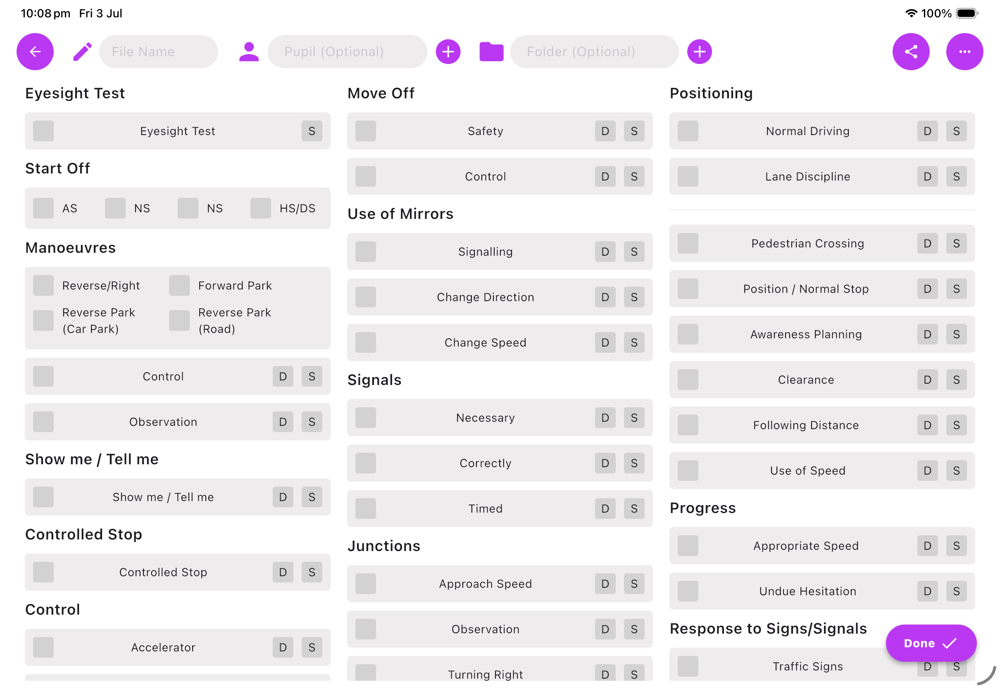

# 👋 Hi, I'm Alfie Gray

I'm a final-year Computer Science student in the UK, expected to graduate in 2026 and currently looking for graduate Software Engineer, Mobile Developer, Full-Stack Developer, or other technology-focused opportunities. I enjoy designing and building full-stack applications with a focus on creating clean, intuitive user experiences. Most of my recent work has been in Flutter, Firebase, and modern web technologies, but I'm always keen to learn new tools and frameworks.

---

## 🚀 About Me

* 🎓 Final-year Computer Science student graduating soon
* 💼 Currently looking for graduate Tech, IT and programming opportunities
* 📱 Building cross-platform applications with Flutter
* ☁️ Interested in cloud technologies, backend development, cryptography, and mobile development
* 🔒 Enjoy building secure, scalable, and well-designed applications

---

## 🛠️ Technologies

### Languages

* Dart
* TypeScript
* JavaScript
* Java
* Python
* C#
* Haskell
* SQL

### Frameworks & Tools

* Flutter
* React
* Firebase
* Git & GitHub
* Docker
* Node.js
* Vite

---

## 📂 Featured Projects

Here are some of the projects I'm currently working on.

### 🚗 Mock Driving Test App

A Flutter application for driving instructors to record mock driving tests digitally, manage pupils, organise test history, and generate reports.

**Tech Stack:** Flutter • Firebase • Cloud Firestore

---

### 💼 Gibraltar Jobs

A job listing platform built with Flutter and Firebase, designed to simplify job searching and recruitment in Gibraltar.

**Tech Stack:** Flutter • Firebase • Typesense

---

### 🖼️ Personal Freelance Website

A responsive portfolio and freelance website showcasing my work, allowing potential clients to browse projects and submit website development enquiries.

**Tech Stack:** Flutter

---

### 🔐 End to End, Peer to Peer Encrypted Chat App

A university project exploring decentralised, privacy-preserving software that replaces centralised trust with peer-to-peer trust relationships, giving users greater control over their data.

**Tech Stack:** Flutter 

---

## 📁 Project Repositories

This repository includes several Git submodules containing my individual projects.

| Project                 | Description |
| ----------------------- | ----------- |
| *(Add repository here)* | Description |
| *(Add repository here)* | Description |
| *(Add repository here)* | Description |

---

## 🎯 Currently Working On

* Expanding the Mock Driving Test App
* Developing the Gibraltar Jobs platform
* Learning more about scalable backend architecture and cloud services

---

## 📫 Get in Touch

I'm always happy to connect and discuss software development, university projects, or graduate opportunities.

* GitHub: https://github.com/yourusername
* LinkedIn: *(Add your profile)*
* Email: *(Add your email if you'd like recruiters to contact you)*

Thanks for stopping by!
