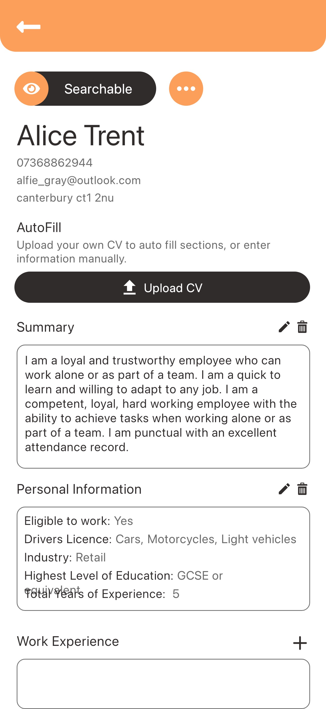
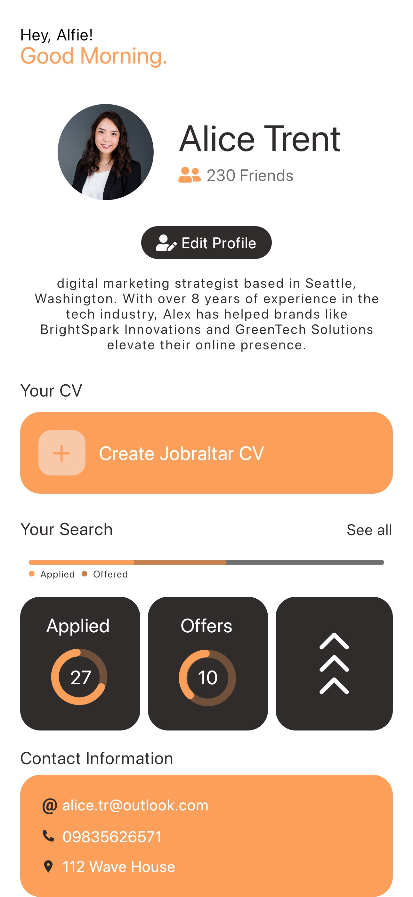
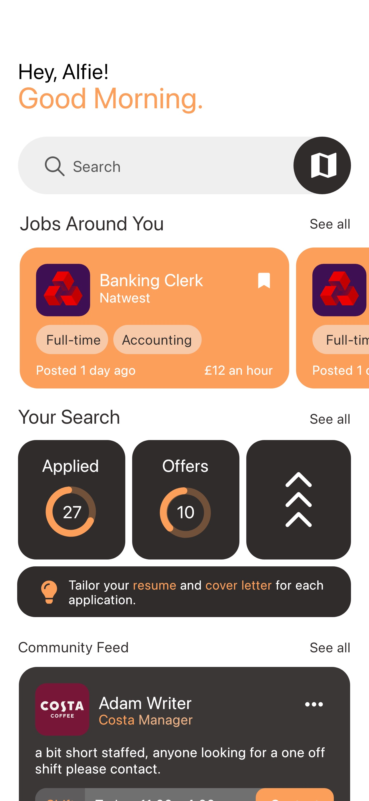
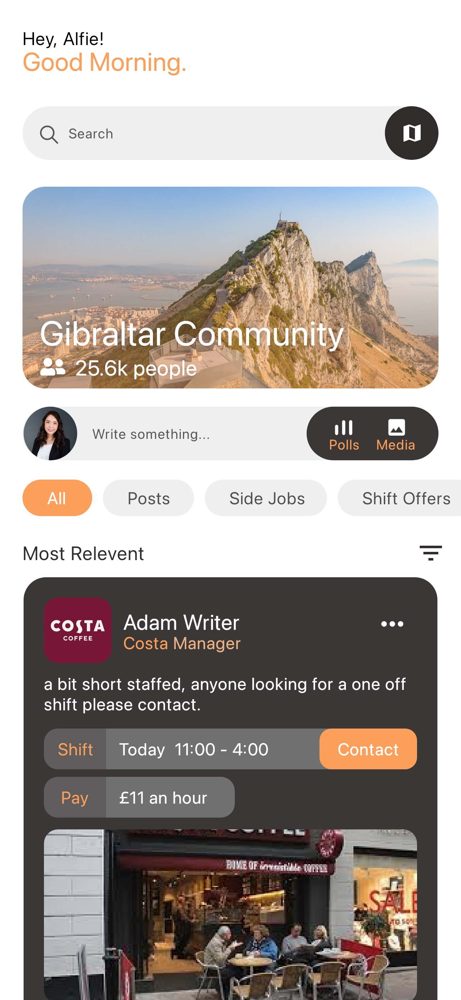
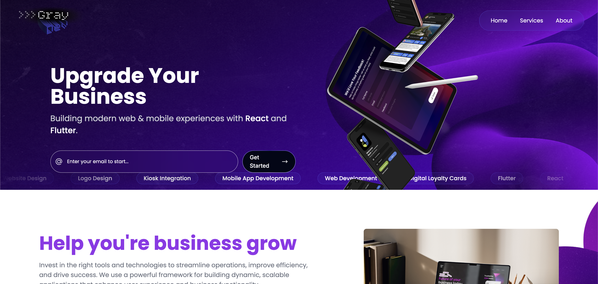
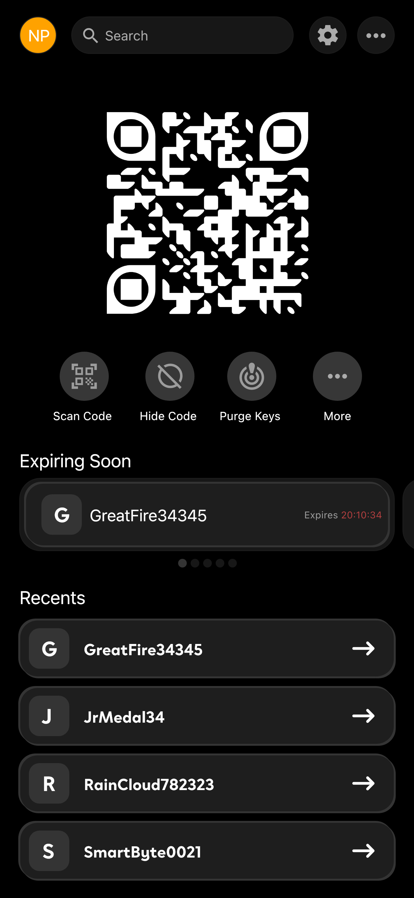

# 👋 Hi, I'm Alfie Gray

I'm a final-year Computer Science student in the UK, expected to graduate in 2026 and currently looking for graduate Software Engineer, Mobile Developer, Full-Stack Developer, or other technology-focused opportunities. I enjoy designing and building full-stack applications with a focus on creating clean, intuitive user experiences. Most of my recent work has been in Flutter, Firebase, and modern web technologies, but I'm always keen to learn new tools and frameworks.

---

## 🚀 About Me

- 📱 Passionate about building real-world mobile and web applications
- 🔒 Interested in privacy, security, and distributed systems
- ☁️ Enjoy working with Firebase and cloud-based architectures
- 🧠 Strong focus on clean UI/UX and maintainable code

---

## 🛠️ Technologies

**Languages**
Dart • TypeScript • JavaScript • Java • Python • C# • Haskell • SQL

**Frameworks & Libraries**
Flutter • React • Node.js • Vite

**Backend & Cloud**
Firebase • Cloud Firestore • Authentication • Cloud Functions

**Tools**
Git • GitHub • Docker • Android Studio • VS Code

---

## 📂 Featured Projects

Here are some of the projects I'm currently working on.

### 🚗 Mock Driving Test App

A digital platform for driving instructors to conduct and record mock driving tests, manage pupils, and track progress over time with Firebase-backed storage.
**Tech Stack:** Flutter • Firebase • Cloud Firestore

---

### 💼 Gibraltar Jobs

  
  
  
  

A job board platform designed to streamline job searching and recruitment in Gibraltar with fast search and filtering using Typesense.

**Tech Stack:** Flutter • Firebase • Typesense

---

### 🖼️ Personal Freelance Website

A responsive portfolio and freelance website showcasing my work, allowing potential clients to browse projects and submit website development enquiries.

**Tech Stack:** Flutter

---

### 🔐 End to End, Peer to Peer Encrypted Chat App

A university project exploring decentralised, privacy-preserving software that replaces centralised trust with peer-to-peer trust relationships, giving users greater control over their data.

**Tech Stack:** Flutter 

---

## 📁 Project Repositories

This repository includes several Git submodules containing my individual projects.

| Project                 | Description |
| ----------------------- | ----------- |
| *https://github.com/alfie-gr/grayDevstudios* | Personal website and project showcase |
| *https://github.com/alfie-gr/IntensiveDriving* | Driving Intructor website displaying prices and checkout |

---

## 💼 What I'm Looking For

I'm currently looking for graduate roles in:
- Software Engineering
- Mobile App Development
- Full-Stack Development

I'm particularly interested in companies working on:
- Scalable web and mobile applications
- Cloud-based systems
- Privacy-focused or security-conscious software

---

## 📫 Get in Touch

I'm always happy to connect and discuss software development, university projects, or graduate opportunities.

* GitHub: https://github.com/alfie-gr
* Email: *alfie_gray@outlook.com*

Thanks for stopping by!
